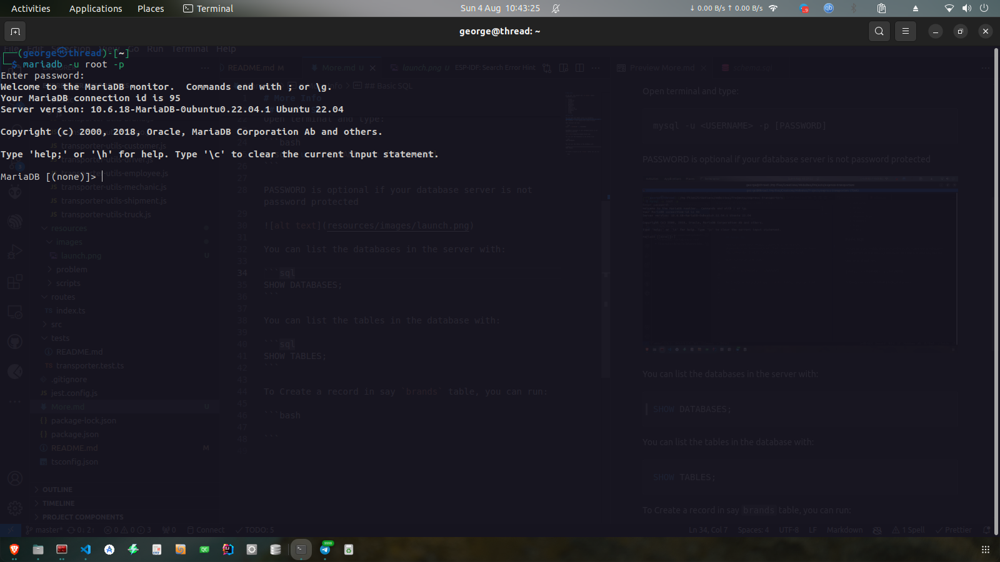

# More Info

As per now, the project has `12 tables` namely (alphabetically):

-   brands
-   categories
-   customers
-   drivers
-   employees
-   mechanics
-   repairs
-   seniorities
-   shipment_trips
-   shipments
-   trips
-   trucks

## Basic SQL

You can open your MySQL client e.g workbench, phpmyadmin or terminal/cmd. Just anywhere you can type SQL commands. I will demonstrate using terminal.

Open terminal and type:

```bash
mysql -u <USERNAME> -p [PASSWORD]
```

PASSWORD is optional if your database server is not password protected



### Note

`SQL` commands are not case sensitive but I will use `UPPERCASE` so that it can be differentiated from my table names.

You can list the databases in the server with:

```sql
SHOW DATABASES;
```


Select your database with:

```sql
USE <DATABASE NAME>;
```

For this case I will execute e.g

```sql
USE transporters;
```


You can list the tables in the database with:

```sql
SHOW TABLES;
```


You can see the tables description with:

```sql
DESC <TABLE NAME>;
```


## Create

To Create a record in a table, you can run:

```sql
INSERT INTO <TABLE NAME> (<COLUMNS>) VALUES (<VALUES MATCHING THE COLUMNS ORDER>);
```


The backticks (**`**) are used mostly when you have multi-word column header, but will not do any harm in single words. They have other functions too.

You can also insert multiple values in a single SQL command:

```sql
INSERT INTO <TABLE NAME> (<COLUMNS>) VALUES (<VALUES1>), (<VALUES2>), (<VALUES2>), ...(<VALUES-N>);
```

## Read/Retrieve

To read data from the database we use the `SELECT` keyword.

```sql
SELECT <COLUMN NAMES> FROM <TABLE NAME>; -- for specific columns
-- OR
SELECT  * FROM <TABLE NAME>; -- to get all columns
```


## Update

To update the field of an entity, we use the `UPDATE` and `SET`keywords in SQL.

The `WHERE` clause is mostly important if you want to update a specific record. Omitting it will set the the entire column with the new value.

```sql
UPDATE <TABLE NAME> SET <COLUMN NAME> = <NEW VALUE> WHERE <PRIMARY KEY COLUMN NAME> = <VALUE>;
```

## Delete

To delete a record from a table we use `DELETE` keyword. Like `UPDATE` it is usually used together with `WHERE` clause so that we delete a specific record. omitting the `WHERE` clause will `delete the entire data in the table`.


